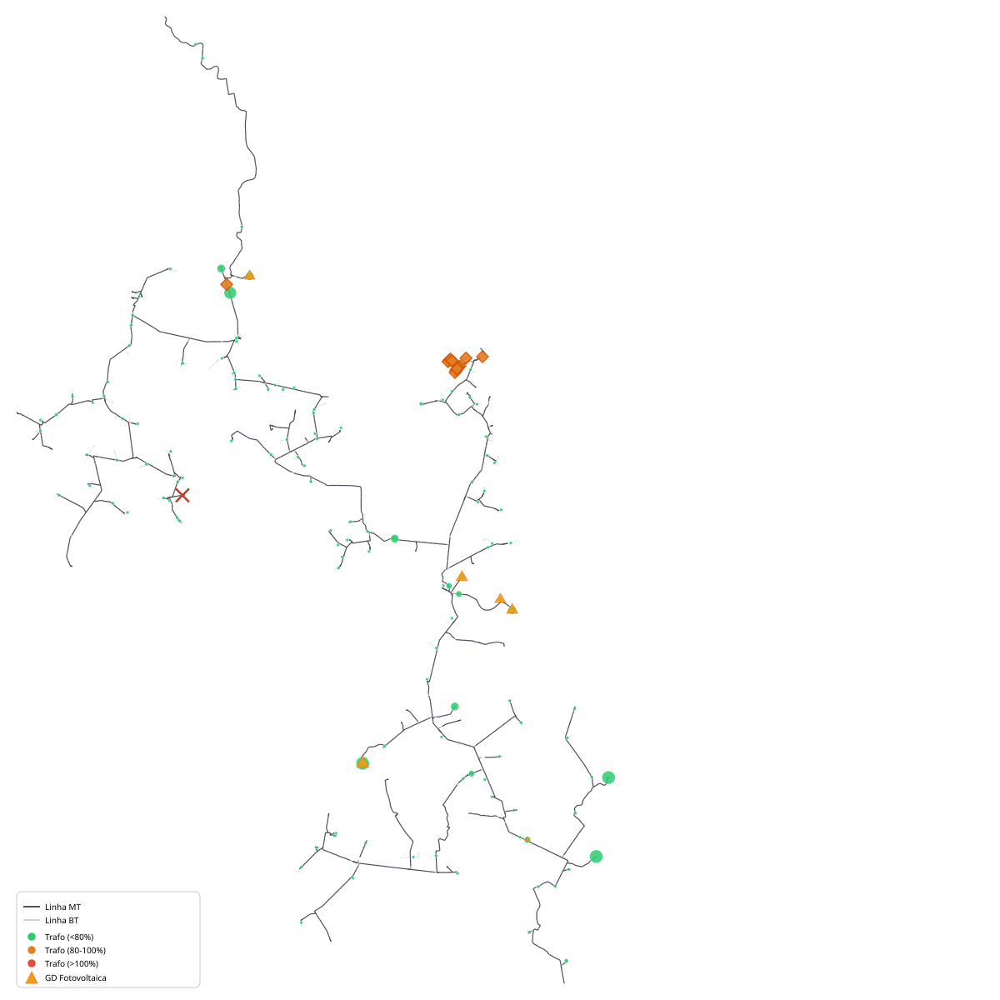
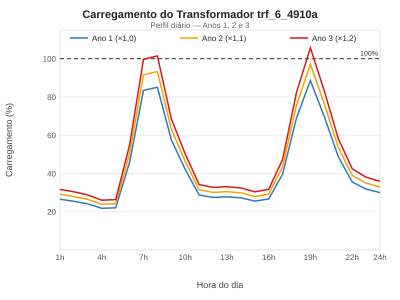
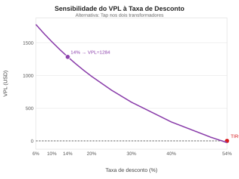
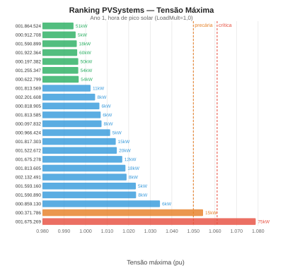

# Planejamento do Relatório — ENG10008 Trabalho 1a
**Formato:** IEEE Transactions/Journal Papers (duas colunas, 10pt Times New Roman)  
**Limite:** 5 páginas incluindo tudo  
**Entrega:** 09/04/2026

---

## Estimativa de espaço (formato IEEE duas colunas)

| Elemento | Espaço estimado |
|---|---|
| Título + autores + abstract + keywords | ~0,3 página |
| Seção I — Introdução | ~0,3 página |
| Seção II — Metodologia | ~0,4 página |
| Seção III — Caracterização do sistema | ~0,3 página |
| Seção IV — Análise do caso base | ~0,5 página |
| Seção V — Alternativas de intervenção | ~0,8 página |
| Seção VI — Avaliação econômica | ~0,5 página |
| Seção VII — Análises complementares | ~0,6 página |
| Seção VIII — Conformidade regulatória | ~0,4 página |
| Seção IX — Conclusões | ~0,2 página |
| Referências | ~0,2 página |
| **Total** | **~4,5 páginas** |

Margem de segurança de 0,5 página para tabelas e figuras que expandem.

---

## Estrutura detalhada

### Título
*Economic Planning of Expansion Alternatives for a Rural Distribution Feeder with Distributed Photovoltaic Generation*

### Abstract (150 palavras)
- Contexto: alimentador rural 23,1 kV, 301 consumidores, 521 kW de GD fotovoltaica
- Problema identificado: sobrecarga do `trf_6_4910a` (30 kVA, 105,7% no Ano 3)
- Metodologia: simulação OpenDSS, avaliação econômica PRODIST, VPL 14% a.a.
- Alternativas avaliadas: 8 (tap, recondutoramento, capacitores, novo trafo, regulador, FP)
- Resultado: tap nos dois trafos — VPL +USD 1.283, TIR 54%, payback 2 anos
- Achado adicional: sobretensão por GD em 4 barramentos BT — não conformidade PRODIST

### Keywords
distributed generation, tap changer, power quality, PRODIST, NPV, rural distribution

---

### I. Introdução (~0,3 pág)
- Contexto da cooperativa CRELUZ e do alimentador analisado
- Crescimento de carga de 10%/ano e degradação da GD de 0,7%/ano
- Objetivo: identificar a melhor alternativa de intervenção técnica e economicamente
- Escopo: 8 alternativas avaliadas, horizonte de 3 anos com análise de longo prazo

**Não incluir:** histórico extenso de literatura — 3 a 4 referências máximo

---

### II. Metodologia (~0,4 pág)
- Ferramenta: OpenDSS via dss-python, modo daily 24h, 1h timestep
- Parâmetros financeiros: tarifa USD 150/MWh, custo perdas USD 35/MWh, TUSD USD 90/MWh
- Fórmula VPL: fluxos de caixa descontados a 14% a.a., valor residual proporcional
- Compensação PRODIST: Módulo 8 item 29, DRP/DRC, faixas Tabela 5 BT
- Monte Carlo: 100 cenários, crescimento uniforme 5–15%/ano
- Modelo de envelhecimento: IEEE C57.91 (Arrhenius), FAA por temperatura de ponto quente

**Figura sugerida:** fluxograma da metodologia de avaliação (pequeno, 1 coluna)

---

### III. Caracterização do sistema (~0,3 pág)
- Topologia: 23,1 kV, 2.240 linhas MT, 177 transformadores, 844 barramentos BT
- GD: 23 PVSystems, 518 kW instalados, FP=0,92 capacitivo
- Perfil de carga: pico hora 9 (829 kW), mínimo noturno (~260 kW)
- GD fornece 22,2% do consumo diário (3.264 kWh de 14.687 kWh)
- Topologia estritamente radial: 79 chaves de manobra, nenhuma normalmente aberta

**Tabela sugerida:** parâmetros principais do alimentador (compacta, 1 coluna)

---

### IV. Análise do caso base (~0,5 pág)
- Resultados do caso base Ano 1: perdas 4,64%, Vmin MT 0,981 pu, Vmin BT 0,941 pu
- Evolução Ano 2 e 3: único trafo sobrecarregado — `trf_6_4910a` (88,5% → 105,7%)
- Curva de duração: 730 h/ano em sobrecarga no Ano 3 (2h/dia todos os dias)
- Resultado financeiro base: resultado operacional USD 57.444/mês
- Monte Carlo: P50=Ano 3, P90=Ano 4 — 100% de probabilidade de sobrecarga até Ano 15

**Tabela sugerida:** resumo caso base Anos 1–3 (perdas, Vmin, trafos sobrecarregados)

---

### V. Alternativas de intervenção (~0,8 pág)

#### V-A. Ajuste de tap (recomendada)
- tap wdg=1 tap=1,0333 em `trf_6_4910a` e `trf_11_305a`
- Carregamento: 105,7% → 102,1% no Ano 3 (tap isolado não resolve: +violações BT)
- Impacto tensão BT: secundário de 208,3V → 201,5V (faixa adequada PRODIST)
- Motivo dos dois trafos: tap isolado gera compensação PRODIST adicional que torna VPL negativo

#### V-B. Recondutoramento
- Linha candidata: `smt_29422` (147 m, R1=1,35 ohm/km)
- Resultado: VPL −USD 914 — rede sem linhas sobrecarregadas (máx 74,5%)

#### V-C. Capacitores
- FP global 0,982 — GD já compensa reativo
- Capacitor fixo 600 kvar: supercompensação (perdas dobram), VPL −USD 27.727
- Capacitor automático: Q máximo na linha de referência de 0,2 kvar — nunca atua

#### V-D. Novo trafo em paralelo
- 30 kVA divide carga igualmente (51%/54% no Ano 3), VPL −USD 2.674
- Benefício de perdas (~USD 115/ano) insuficiente frente ao CAPEX de USD 6.000

#### V-E. Regulador de tensão e FP dos inversores
- Regulador ±10%: aumenta perdas (+23 kWh/dia), VPL −USD 6.207
- FP 0,92→0,95: VPL +USD 20, economia USD 13/ano — medida complementar sem CAPEX

**Tabela sugerida:** comparativo das 8 alternativas (CAPEX, VPL, atrativo) — tabela principal do artigo

---

### VI. Avaliação econômica (~0,5 pág)
- Alternativa recomendada: tap nos dois trafos, CAPEX USD 1.500
- VPL: +USD 1.283 (14% a.a.) — positivo para taxas até 54% (TIR)
- Sensibilidade: atrativo de 6% a 25% de taxa de desconto, payback 2 anos em todos os cenários
- Risco de falha (Arrhenius): FAA=7,32 a 105,7%, P(falha)=26,5% no Ano 3
- VP do risco = USD 1.807 > CAPEX do tap: o tap se paga só pelo risco eliminado
- VPL incluindo risco: +USD 3.090
- Custo do atraso: USD 56/mês — atraso de 2 anos torna VPL negativo
- Recomendação complementar: FP 0,95 nos inversores (custo zero, USD 13/ano)

**Figura sugerida:** gráfico VPL × taxa de desconto (6%–25%) mostrando robustez

---

### VII. Análises de longo prazo (~0,6 pág)

#### VII-A. Horizonte de 15 anos
- 5 trafos com alerta: `trf_6_3509a` (5 kVA) entra em sobrecarga no Ano 10
- Remanejamento: break-even no Ano 6 com risco contabilizado
- Recomendação: planejar remanejamento agora para execução antes do Ano 5

#### VII-B. Análise N-1 e confiabilidade
- Abertura de `smt_31408` (74,5%): 83 barramentos MT e 6 trafos sem tensão
- Rede radial estritamente sem pontos de manobra (79 chaves, 0 normalmente abertas)
- Efeito dominó estruturalmente impossível: falha causa interrupção, não cascata
- Recomendação: instalar pelo menos uma chave seccionadora de interligação no ramal principal

#### VII-C. Expansão da GD
- GD +20% no Ano 3: sem impacto no `trf_6_4910a` (ramal isolado da GD)
- Sem fluxo reverso mesmo com +20% — margem de ~35% de segurança
- FP ótimo da frota: 0,95 (reduz perdas em 1,0 kWh/dia vs FP 0,92 atual)

---

### VIII. Conformidade regulatória — Sobretensões por GD (~0,4 pág)
- 4 barramentos BT com violação PRODIST Tabela 5: 2 críticos, 2 precários
- Causa: `PVSystem.gd.rs.001.675.269` (75 kW) com relação GD/carga de 23×
- Confirmado: sem GD todos os barramentos retornam à faixa adequada
- FP 1,00 resolve parcialmente (Vmax 1,079→1,047 pu) mas aumenta perdas
- Ranking dos 23 PVSystems: 43% mal posicionados (Vmax > 1,014 pu), 2 com violação real
- Recomendação: curtailment por tensão nos 2 inversores identificados

**Tabela sugerida:** 4 barramentos com DRP/DRC (compacta)

---

### IX. Conclusões (~0,2 pág)
1. Ajuste de tap nos dois trafos — única alternativa economicamente atrativa (VPL +USD 3.090 com risco)
2. Ajuste de FP 0,92→0,95 — medida complementar sem CAPEX
3. Planejamento do remanejamento do `trf_6_4910a` para horizonte de 5 anos
4. Sobretensão por GD em 4 barramentos — não conformidade PRODIST identificada
5. Rede radial sem redundância — vulnerável a falhas simples

---

### Referências (~0,2 pág)
1. ANEEL. PRODIST Módulo 8 — Qualidade da Energia Elétrica. 2023.
2. IEEE Std C57.91-2011 — Guide for Loading Mineral-Oil-Immersed Transformers.
3. Dugan, R.C. et al. *Electrical Power Systems Quality*. McGraw-Hill, 2012.
4. OpenDSS Documentation. Electric Power Research Institute (EPRI), 2023.
5. IEEE Std 1547-2018 — Standard for Interconnection of Distributed Energy Resources.

---

## O que NÃO entra no relatório (dados disponíveis mas fora do limite de páginas)

- Tabela completa DRP/DRC de 844 barramentos → mencionar que está em anexo/CSV
- Ranking completo dos 23 PVSystems → citar só os 2 críticos e a síntese
- Curva de duração completa hora a hora → mostrar só os limiares 80/90/100%
- Monte Carlo distribuição completa → mostrar só P10/P50/P90
- Break-even detalhado do remanejamento → citar só o Ano 6
- Análise de crescimento assimétrico → mencionar em uma frase

## Figuras e tabelas planejadas

| # | Tipo | Conteúdo | Seção | Colunas |
|---|---|---|---|---|
| Fig. 1 | Fluxograma | Metodologia de avaliação | II | 1 |
| Tab. I | Tabela | Parâmetros do alimentador | III | 1 |
| Tab. II | Tabela | Caso base Anos 1–3 | IV | 1 |
| Tab. III | Tabela | Comparativo 8 alternativas (principal) | V | 2 |
| Fig. 2 | Gráfico | VPL × taxa de desconto | VI | 1 |
| Tab. IV | Tabela | Barramentos com violação PRODIST | VIII | 1 |

Total: 2 figuras + 4 tabelas — razoável para 5 páginas IEEE.

---

## Checklist de escrita

- [ ] Abstract em inglês (IEEE padrão)
- [ ] Todas as seções em inglês ou português? → definir antes de começar
- [ ] Equações da compensação PRODIST numeradas
- [ ] Tabela III referenciada no texto antes de aparecer
- [ ] Fig. 2 com eixo x de 6% a 25% e linha tracejada em 14%
- [ ] Conclusões em forma de lista numerada (IEEE aceita)
- [ ] Referências no formato IEEE (sobrenome, inicial, título em aspas, revista em itálico)
- [ ] Verificar limite de 5 páginas antes de submeter

---

### Anexos Digitais
- **Mapa Interativo de Ativos:** [mapa_ativos_camadas.svg](../resultados/mapa_ativos_camadas.svg) (Abrir em navegador para interatividade)
- **Gráficos de Balanço e Tensão:** [grafico_balanco_energetico.svg](../resultados/graficos/grafico_balanco_energetico.svg), [grafico_tensao_bt.svg](../resultados/graficos/grafico_tensao_bt.svg)
